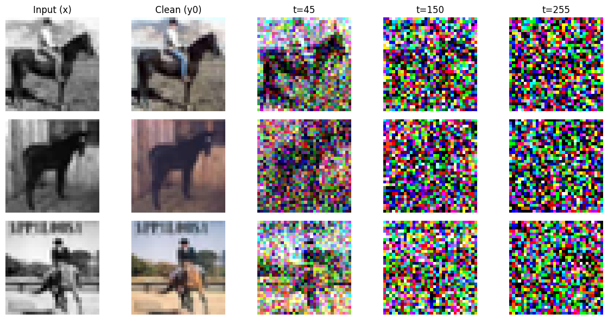
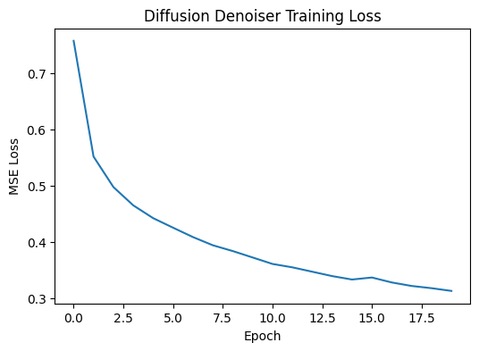
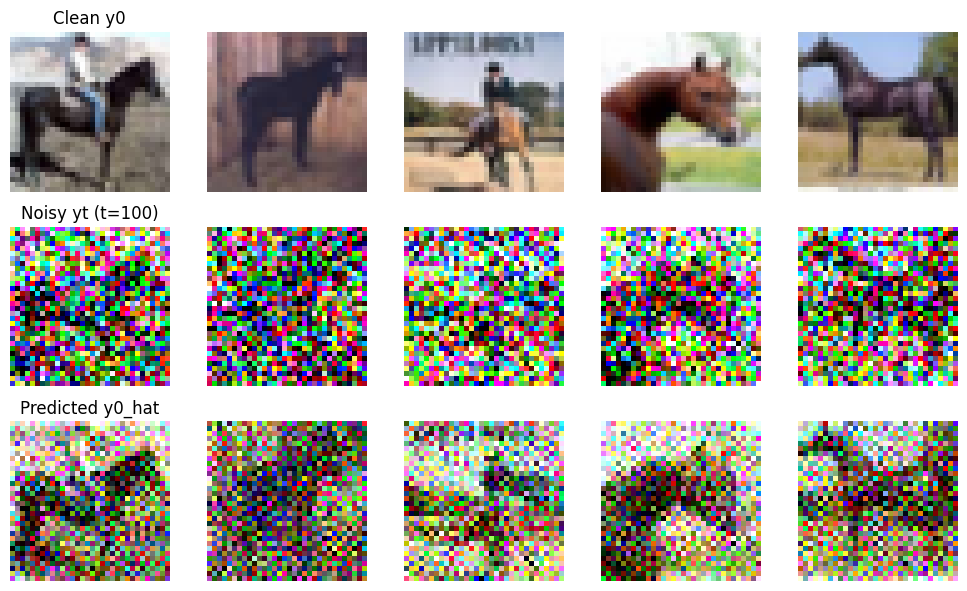

# Diffusion Denoising for Image Colorization

Conditional diffusion-style denoising prototype for grayscale-to-color image reconstruction on CIFAR-10 horse images.

[](https://colab.research.google.com/drive/1YWRGSb55fxymbpC50D5WSulc4_xWoU-r?usp=sharing) [GitHub Repo](https://github.com/DDaswE/diffusion-denoising-for-image-colorization)

> Opening this notebook in Colab creates a working copy. The source notebook in GitHub remains unchanged unless a user already has write access to this repository.

## Preview



**Figure 1.** Forward diffusion process: grayscale condition, clean color target, and progressively noised color images at multiple timesteps.



**Figure 2.** Denoiser training loss over 20 epochs, showing the noise-prediction objective decreasing to 0.3127 MSE.



**Figure 3.** One-step conditional denoising examples at timestep 100: clean color image, noised input, and reconstructed color estimate.

## Project summary

This project implements a diffusion-style conditional denoising model for grayscale-to-color image reconstruction. Instead of presenting a full multi-step DDPM sampler, the project focuses on the core mechanics of diffusion modeling: forward noising, timestep conditioning, noise prediction, and one-step reconstruction from a noisy color image conditioned on a grayscale input.

## Problem

This project asks how diffusion-model mechanics can be adapted to image colorization:

> Given a grayscale image `x` and a noisy color image `y_t`, learn a denoising model that predicts the injected noise and recovers an estimate of the clean color image `y_0`.

The setup treats the forward noising process as a fixed encoder and the learned denoiser as a conditional reverse step. This makes diffusion modeling interpretable in the same colorization setting used for autoencoders and conditional VAEs.

## Data

- CIFAR-10 image dataset
- horse-class subset used for the colorization task
- grayscale input images paired with RGB color targets
- 32 x 32 image resolution

## Techniques

- RGB-to-grayscale preprocessing
- linear beta schedule with 300 diffusion timesteps
- DDPM-style forward noising equation
- timestep-conditioned neural network
- U-Net-style encoder/decoder denoiser with skip connection
- noise-prediction objective using MSE loss
- one-step reconstruction from predicted noise
- qualitative comparison across clean, noised, and reconstructed images

## Achievements

- implemented a forward diffusion process that corrupts clean color targets across low, medium, and high-noise timesteps
- built a conditional denoiser that combines noisy RGB input, grayscale condition, and timestep embedding
- trained the denoiser for 20 epochs with training loss decreasing to 0.3127 MSE
- reconstructed approximate clean color images from noisy inputs using the predicted noise
- connected diffusion noise level with fidelity-diversity behavior in generative colorization

## Repository structure

| File | Role |
| --- | --- |
| `diffusion_denoising_image_colorization.py` | Standalone PyTorch training and visualization script |
| `requirements.txt` | Python dependencies for running the script |
| `assets/forward_diffusion.png` | Forward noising visualization |
| `assets/denoiser_training_loss.png` | Training-loss curve from the denoiser run |
| `assets/one_step_denoising.png` | One-step conditional denoising visualization |

## How to run

```bash
pip install -r requirements.txt
python diffusion_denoising_image_colorization.py --epochs 20 --batch-size 64 --output-dir outputs
```

The script downloads CIFAR-10 if it is not already available, filters the horse class, trains the conditional denoiser, and writes regenerated preview images to the output directory.

## Skills practiced

This project practices diffusion-model fundamentals, conditional denoising, timestep embeddings, PyTorch training loops, image preprocessing, U-Net-style reconstruction, and visual evaluation for generative computer vision.
